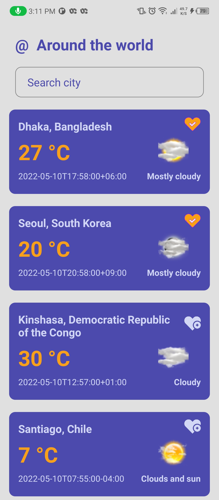
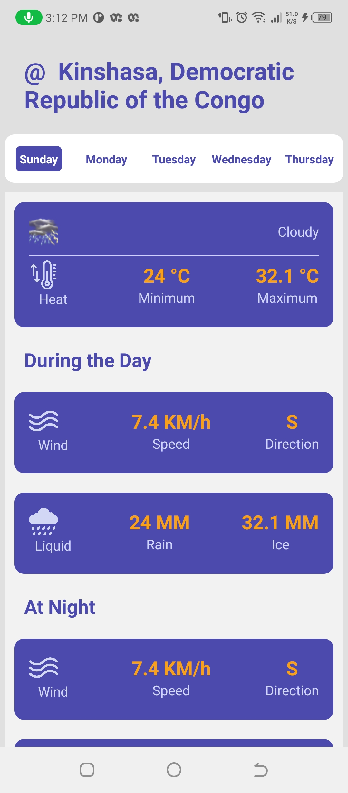
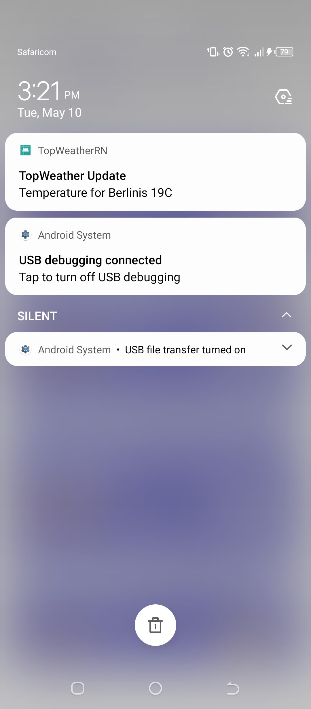

# TopWeather APP

TopWeather is a weather app that diaplays current wearther for top cities
as well as detailed info for each city

## Data Source

The data is fethed from [AccuWeather_API](https://developer.accuweather.com/)

## Features
 * List of Current Temperatures for 50 Cities (Favorites come first)
 * Search by City name or Country name
 * Details for temperature, wind and rain
 * Favorite Cities
 * Hourly updates for Favorite Cities
 * Works offline once data is pulled

 ## Screenshots

 
 
 

## Top Libraries Used

 * [Realm](https://www.mongodb.com/docs/realm/sdk/react-native/) for offline Persistence
 * [Notifee](https://notifee.app/react-native/docs) for the notification display

